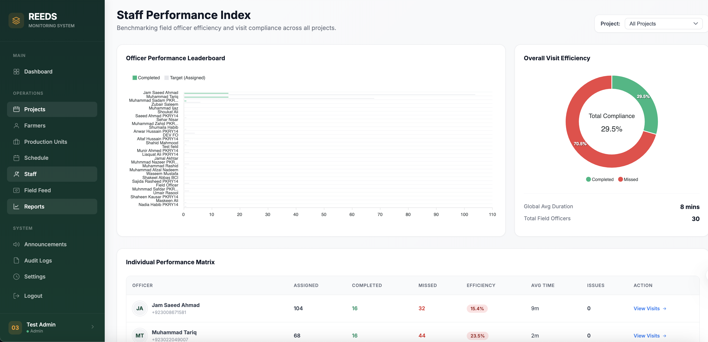
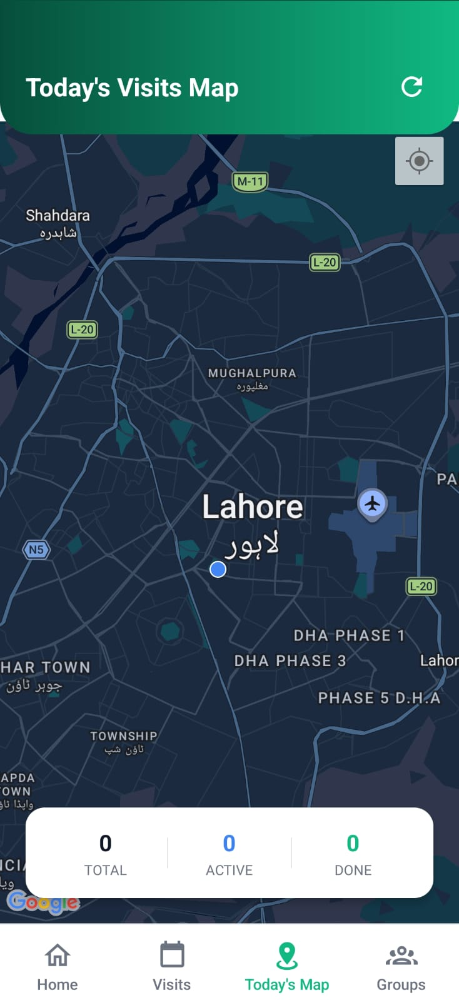
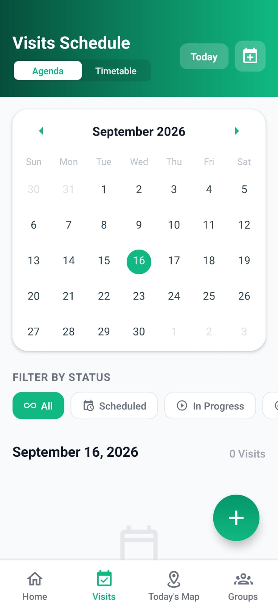
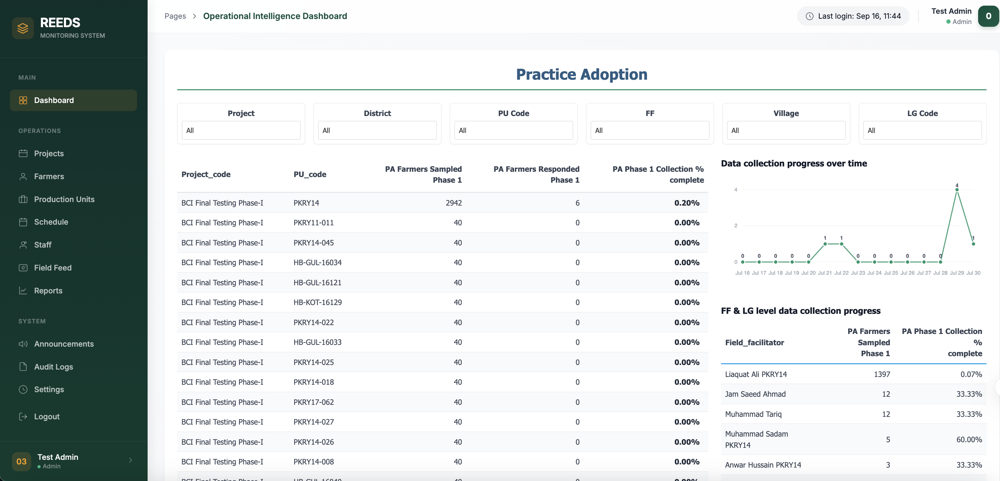

# REEDS Monitoring System — Field Monitoring Platform

> **Note:** This repository is a case study, not a source dump. It was built at Prismatic Technologies Limited for an NGO's agricultural field monitoring program; the source is proprietary. This README documents the architecture, my role, and the engineering decisions behind it.

 

## Overview

REEDS (ReedsNGO Field Monitoring System) is an end-to-end web portal and React Native mobile app for managing an NGO's agricultural and farmer monitoring programs. It tracks projects, farmer demographics, production units (PUs), and geographic locations across individual farmers, farmer groups, and production units — exposing a secure API that field agents use from the mobile app.

The system was purpose-built for **unreliable rural connectivity**: field officers can check in/out on-site, mark attendance, and log activities with photos while completely offline, with updates automatically queued and synced once a connection is restored.

## My Role

Built the entire system solo — both the Django/DRF backend and web admin, and the React Native mobile application, including navigation, offline sync, map-based geofencing, and push notifications.

## Tech Stack

| Layer | Technologies |
|---|---|
| Mobile | React Native 0.84, TypeScript, React 19, Redux Toolkit, React Navigation (Tabs + Native Stack) |
| Backend / Web Admin | Python, Django, Django REST Framework, PostgreSQL / SQLite |
| Location & Offline | React Native Maps, Geolocation, AsyncStorage, NetInfo, Axios |
| Notifications & Auth | Firebase Cloud Messaging, Notifee, JWT Authentication |
| UI & Utilities | Day.js, React Native Calendars, Chart Kit, Image Picker, Excel-based bulk import |

## Architecture

```
┌─────────────────────┐        REST / JWT        ┌──────────────────────┐
│   React Native App   │ ───────────────────────▶ │  Django REST Backend │
│  (Field Officers)    │ ◀─────────────────────── │   + PostgreSQL       │
└─────────┬────────────┘                           └──────────┬───────────┘
          │ offline queue (AsyncStorage + NetInfo)             │
          │ auto-sync on reconnect                             │
          ▼                                                    ▼
   Local action queue                                  Admin Web Dashboard
   (check-in/out, attendance,                          (role-based, audit logs)
    photos, activity logs)
```

## Standout Features

- **Geofenced Visit Enforcement** — check-in, attendance, activity logging, and check-out are only permitted when the officer is physically within the visit's defined map radius.
- **Offline-First Field Ops** — full offline queueing for visit lifecycle actions (session start/end, attendance, photos, log entries), with automatic background sync on reconnect.
- **Map-Based Scheduling & "Today's Map"** — interactive map for setting visit geofences, plus a real-time daily view of scheduled routes.
- **Workflow Automation** — prefilled visit scheduling directly from PU/farmer lists or group creation, with one-tap rescheduling from prior visit data.
- **Bulk Onboarding & Search** — Excel-based bulk import for farmer onboarding on the admin portal, paired with paginated infinite-scroll search on mobile for large datasets.
- **Role-Based Access & Audit Logs** — admin web dashboards with role-based permissions and full audit trails.

## Screenshots

<!-- See the "how to add screenshots" guidance in chat — insert images below in this section -->

| Map-Based Check-In | Offline Sync Queue | Today's Map |
|---|---|---|
|  |  |  |

| Attendance & Activity Log | Farmer/PU Search | Admin Dashboard |
|---|---|---|
|  |  |  |

## What I'd Improve Next

- Add conflict resolution for offline edits made on multiple devices before sync
- Move bulk import validation to an async job queue for larger datasets
